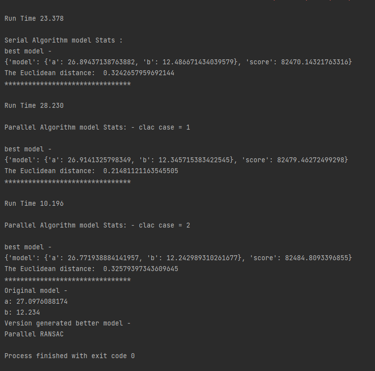

# RANSAC-Assignment

For making the RANSAC algorithm parallel I checked two options of calculations -

1. Simple map-reduce:
    1. mapping each model and calculate his score
    2. reduce by finding the best model by comparing the total score
2. Using map and DataFrame:
    1. mapping each model and the samples for calculate the score
    2. creating PySpark DataFrame with the mapping result
    3. OrderBy totalScore and get the first element

Added output of a run with the original serial algorithm and the 2 parallel options. The program parameters:

- file_path: 'input files\\samples_for_line_a_27.0976088174_b_12.234 (2).csv
- a: 27.0976088174
- b: 12.234
- number of samples: 10,000
- iterations: 5,000
- cut_off: 20

the parallel version is almost 2 times faster than the basic version !

# Console output screen snip -

